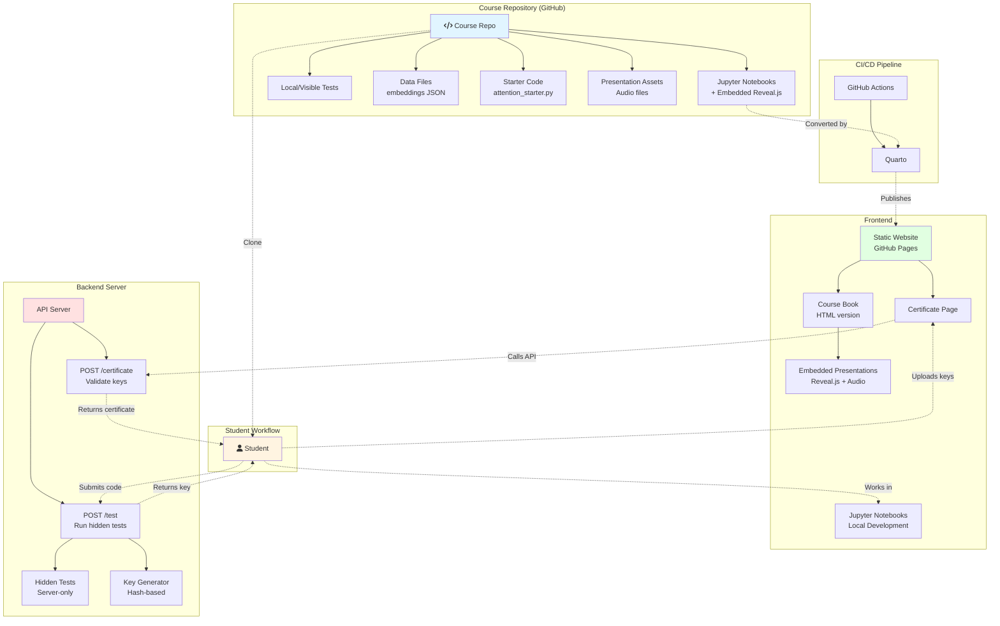

# Technology Stack Diagram

## System Architecture

## Technology Components

### Course Repository
- **Jupyter Notebooks**: Interactive lessons with embedded reveal.js presentations and audio
- **Local Tests**: Visible unit tests students can run to verify their work
- **Data Files**: Pre-calculated word embeddings (JSON) for testing
- **Starter Code**: `attention_starter.py` with function signatures and type hints
- **Assets**: Audio files and presentation resources

### CI/CD Pipeline
- **GitHub Actions**: Automated build and deployment workflow
- **Quarto**: Converts Jupyter notebooks to HTML while preserving embedded presentations
- **GitHub Pages**: Hosts the static website

### Frontend
- **Jupyter Notebooks**: Primary learning environment (runs locally)
- **Static Website**:
  - Course book (HTML version of notebooks)
  - Certificate generation page
  - Embedded reveal.js presentations with audio

### Backend (API Server)
- **Test Endpoint** (`POST /test`):
  - Receives student code submissions
  - Runs hidden tests (not in repository)
  - Generates unique key on success (hash-based)
  - Returns key to student

- **Certificate Endpoint** (`POST /certificate`):
  - Receives all student keys
  - Validates key hashes
  - Generates certificate of completion

## Student Flow

1. **Clone** course repository
2. **Work** in Jupyter notebooks locally
3. **Complete** programming assignments
4. **Submit** code to API → Server runs hidden tests
5. **Receive** unique key if tests pass
6. **Repeat** for all modules
7. **Upload** all keys to certificate page
8. **Receive** certificate after validation

## Key Design Decisions

- **Hash-based Certificate System**: Prevents cheating while allowing self-paced learning
- **Hidden Tests**: Ensures academic integrity (tests not visible in repo)
- **Embedded Presentations**: All content in one place (notebooks), automatically published to web
- **Static Website**: No database needed for course delivery, scalable and free hosting
- **Local-first Development**: Students work offline, only connect to server for validation
