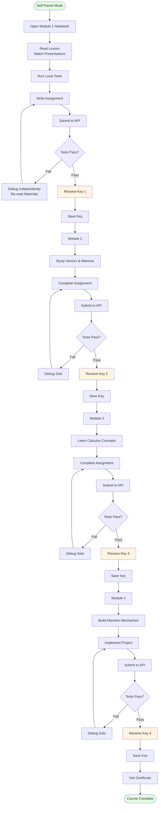

# User Journey Diagram

## Two Learning Paths


## Path 1: Self-Paced Journey



## Path 2: Mentor-Led Journey

```mermaid
flowchart TD
    START_MENTOR([Mentor-Led Mode]) --> KICKOFF[Kickoff Meeting<br/>Mentor + Student]
    KICKOFF --> PLAN[Set Learning Schedule<br/>Meeting Cadence]

    PLAN --> M1_MENTOR[Module 1: Intuition]

    subgraph "Module 1 Cycle"
        M1_MENTOR --> PRE1[Pre-work:<br/>Read Lesson, Watch Presentations]
        PRE1 --> MEET1[Mentor Meeting 1<br/>Discuss Concepts]
        MEET1 --> WORK1[Work on Assignment<br/>Apply Feedback]
        WORK1 --> REVIEW1[Code Review<br/>with Mentor]
        REVIEW1 --> REVISE1{Mentor<br/>Approves?}
        REVISE1 -->|No| FEEDBACK1[Receive Feedback<br/>Revise Code]
        FEEDBACK1 --> WORK1
        REVISE1 -->|Yes| SUBMIT1[Submit to API]
        SUBMIT1 --> TEST1{Tests Pass?}
        TEST1 -->|Fail| DEBUG_M1[Debug with<br/>Mentor Support]
        DEBUG_M1 --> WORK1
        TEST1 -->|Pass| KEY1[Receive Key 1]
        KEY1 --> SAVE1[Save Key]
    end

    SAVE1 --> M2_MENTOR[Module 2: Geometry]

    subgraph "Module 2 Cycle"
        M2_MENTOR --> PRE2[Pre-work:<br/>Study Linear Algebra]
        PRE2 --> MEET2[Mentor Meeting 2<br/>Math Deep Dive]
        MEET2 --> WORK2[Work on Assignment]
        WORK2 --> REVIEW2[Code Review]
        REVIEW2 --> REVISE2{Mentor<br/>Approves?}
        REVISE2 -->|No| FEEDBACK2[Receive Feedback]
        FEEDBACK2 --> WORK2
        REVISE2 -->|Yes| SUBMIT2[Submit to API]
        SUBMIT2 --> TEST2{Tests Pass?}
        TEST2 -->|Fail| DEBUG_M2[Debug with Mentor]
        DEBUG_M2 --> WORK2
        TEST2 -->|Pass| KEY2[Receive Key 2]
        KEY2 --> SAVE2[Save Key]
    end

    SAVE2 --> M3_MENTOR[Module 3: Learning]

    subgraph "Module 3 Cycle"
        M3_MENTOR --> PRE3[Pre-work:<br/>Study Calculus]
        PRE3 --> MEET3[Mentor Meeting 3<br/>Loss Landscapes]
        MEET3 --> WORK3[Work on Assignment]
        WORK3 --> REVIEW3[Code Review]
        REVIEW3 --> REVISE3{Mentor<br/>Approves?}
        REVISE3 -->|No| FEEDBACK3[Receive Feedback]
        FEEDBACK3 --> WORK3
        REVISE3 -->|Yes| SUBMIT3[Submit to API]
        SUBMIT3 --> TEST3{Tests Pass?}
        TEST3 -->|Fail| DEBUG_M3[Debug with Mentor]
        DEBUG_M3 --> WORK3
        TEST3 -->|Pass| KEY3[Receive Key 3]
        KEY3 --> SAVE3[Save Key]
    end

    SAVE3 --> M4_MENTOR[Module 4: Transformer]

    subgraph "Module 4 Cycle"
        M4_MENTOR --> PRE4[Pre-work:<br/>Review All Concepts]
        PRE4 --> MEET4[Mentor Meeting 4<br/>Project Planning]
        MEET4 --> BUILD[Build Attention Mechanism]
        BUILD --> CHECKIN[Progress Check-ins<br/>with Mentor]
        CHECKIN --> REVIEW4[Final Code Review]
        REVIEW4 --> REVISE4{Mentor<br/>Approves?}
        REVISE4 -->|No| FEEDBACK4[Receive Feedback]
        FEEDBACK4 --> BUILD
        REVISE4 -->|Yes| SUBMIT4[Submit to API]
        SUBMIT4 --> TEST4{Tests Pass?}
        TEST4 -->|Fail| DEBUG_M4[Debug with Mentor]
        DEBUG_M4 --> BUILD
        TEST4 -->|Pass| KEY4[Receive Key 4]
        KEY4 --> SAVE4[Save Key]
    end

    SAVE4 --> FINAL_MEET[Final Meeting<br/>Celebrate Success]
    FINAL_MEET --> CERT_MENTOR[Get Certificate]
    CERT_MENTOR --> END_MENTOR([Course Complete])

    style START_MENTOR fill:#fff4e1
    style END_MENTOR fill:#fff4e1
    style KEY1 fill:#ffe1e1
    style KEY2 fill:#ffe1e1
    style KEY3 fill:#ffe1e1
    style KEY4 fill:#ffe1e1
```



## Comparison: Self-Paced vs Mentor-Led


## Key Differences

| Aspect | Self-Paced | Mentor-Led |
|--------|-----------|------------|
| **Support** | Materials only (notebooks, presentations) | Mentor guidance + materials |
| **Feedback Loop** | API test results only | Code reviews + mentor feedback before submission |
| **Debugging** | Independent problem-solving | Collaborative debugging sessions |
| **Schedule** | Flexible, student's pace | Structured meetings (weekly/bi-weekly) |
| **Accountability** | Self-driven | Mentor check-ins |
| **Learning Depth** | Can skip to "make it work" | Mentor ensures deep understanding |
| **Time Commitment** | 8-10 hrs/week solo | 8-10 hrs/week + 1-2 hrs mentor meetings |

## Mentor Touchpoints

### Kickoff Meeting
- Set expectations and goals
- Establish meeting schedule
- Review course structure
- Assess student's current knowledge

### Module Meetings (4 total)
- **Before assignment**: Discuss concepts, answer questions
- **During assignment**: Progress check-ins, unblock issues
- **Code review**: Review solution before API submission
- **After submission**: Celebrate success, prep for next module

### Final Meeting
- Review complete journey
- Discuss career applications
- Provide recommendation/endorsement
- Celebrate certificate achievement

## Emotional Journey Comparison

### Self-Paced
```
Excitement → Confusion → Frustration → Breakthrough → Pride
     ↓           ↓            ↓              ↓           ↓
  Module 1   Module 2    Module 3      Module 4   Certificate
```

### Mentor-Led
```
Excitement → Supported Learning → Guided Progress → Mastery → Pride
     ↓              ↓                    ↓             ↓         ↓
  Kickoff      Modules 1-3          Module 4      Review    Certificate
```

**Key Difference**: Mentor-led reduces frustration valleys through continuous support, but self-paced offers more flexibility and autonomy.
